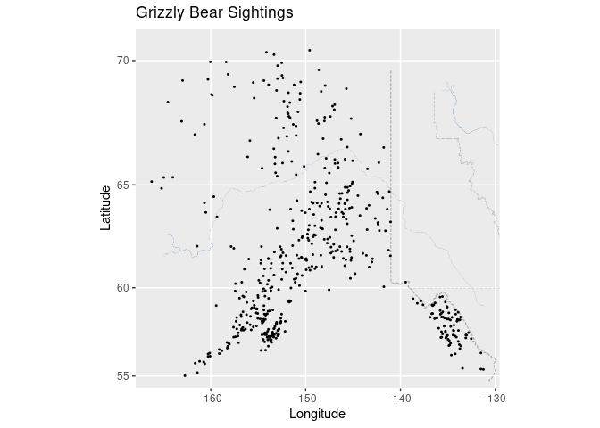
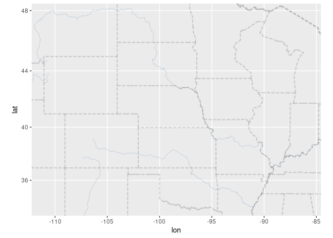
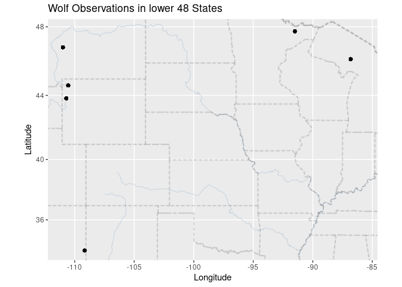
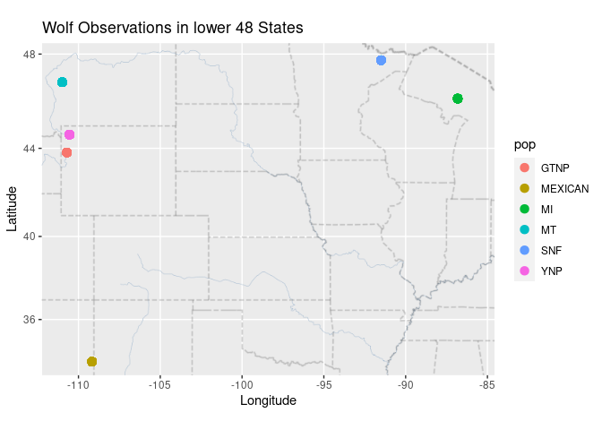

## Instructions
Answer the following questions and complete the exercises in RMarkdown. Please embed all of your code and push your final work to your repository. Your final lab report should be organized, clean, and run free from errors. Remember, you must remove the `#` for the included code chunks to run. Be sure to add your name to the author header above. For any included plots, make sure they are clearly labeled. You are free to use any plot type that you feel best communicates the results of your analysis.  

Make sure to use the formatting conventions of RMarkdown to make your report neat and clean!  

## Load the libraries  

```r
library(tidyverse)
library(janitor)
library(here)
library(ggmap)
```


## Load the Data
We will use two separate data sets for this homework.  

1. The first [data set](https://rcweb.dartmouth.edu/~f002d69/workshops/index_rspatial.html) represent sightings of grizzly bears (Ursos arctos) in Alaska.  

2. The second data set is from Brandell, Ellen E (2021), Serological dataset and R code for: Patterns and processes of pathogen exposure in gray wolves across North America, Dryad, [Dataset](https://doi.org/10.5061/dryad.5hqbzkh51).  

1. Load the `grizzly` data and evaluate its structure.  

```r
grizzly <- read_csv("data/bear-sightings.csv")
```

```
## Rows: 494 Columns: 3
## ── Column specification ────────────────────────────────────────────────────────
## Delimiter: ","
## dbl (3): bear.id, longitude, latitude
## 
## ℹ Use `spec()` to retrieve the full column specification for this data.
## ℹ Specify the column types or set `show_col_types = FALSE` to quiet this message.
```

```r
summary(grizzly)
```

```
##     bear.id       longitude         latitude    
##  Min.   :   7   Min.   :-166.2   Min.   :55.02  
##  1st Qu.:2569   1st Qu.:-154.2   1st Qu.:58.13  
##  Median :4822   Median :-151.0   Median :60.97  
##  Mean   :4935   Mean   :-149.1   Mean   :61.41  
##  3rd Qu.:7387   3rd Qu.:-145.6   3rd Qu.:64.13  
##  Max.   :9996   Max.   :-131.3   Max.   :70.37
```

```r
head(grizzly)
```

```
## # A tibble: 6 × 3
##   bear.id longitude latitude
##     <dbl>     <dbl>    <dbl>
## 1       7     -149.     62.7
## 2      57     -153.     58.4
## 3      69     -145.     62.4
## 4      75     -153.     59.9
## 5     104     -143.     61.1
## 6     108     -150.     62.9
```


2. Use the range of the latitude and longitude to build an appropriate bounding box for your map.  

```r
grizzly %>%
  select(longitude, latitude) %>%
  summary()
```

```
##    longitude         latitude    
##  Min.   :-166.2   Min.   :55.02  
##  1st Qu.:-154.2   1st Qu.:58.13  
##  Median :-151.0   Median :60.97  
##  Mean   :-149.1   Mean   :61.41  
##  3rd Qu.:-145.6   3rd Qu.:64.13  
##  Max.   :-131.3   Max.   :70.37
```

```r
long <- c(-166.2, -131.3)
lat <- c(55.02, 70.37)
bbox <- make_bbox(long, lat, f=0.05)
```


3. Load a map from `stamen` in a terrain style projection and display the map.  

```r
map <- get_map(bbox, maptype = "terrain-lines", source = "stamen")
```

```
## ℹ Map tiles by Stamen Design, under CC BY 3.0. Data by OpenStreetMap, under ODbL.
```


4. Build a final map that overlays the recorded observations of grizzly bears in Alaska.  

```r
ggmap(map)+
  geom_point(data=grizzly, aes(longitude, latitude), size=0.4)+
  labs(x="Longitude", y="Latitude", title="Grizzly Bear Sightings")
```

<!-- -->


Let's switch to the wolves data. Brandell, Ellen E (2021), Serological dataset and R code for: Patterns and processes of pathogen exposure in gray wolves across North America, Dryad, [Dataset](https://doi.org/10.5061/dryad.5hqbzkh51).  

5. Load the data and evaluate its structure.  

```r
wolves <- read_csv("data/wolves_data/wolves_dataset.csv")
```

```
## Rows: 1986 Columns: 23
## ── Column specification ────────────────────────────────────────────────────────
## Delimiter: ","
## chr  (4): pop, age.cat, sex, color
## dbl (19): year, lat, long, habitat, human, pop.density, pack.size, standard....
## 
## ℹ Use `spec()` to retrieve the full column specification for this data.
## ℹ Specify the column types or set `show_col_types = FALSE` to quiet this message.
```

```r
head(wolves)
```

```
## # A tibble: 6 × 23
##   pop     year age.cat sex   color   lat  long habitat human pop.density pack.…¹
##   <chr>  <dbl> <chr>   <chr> <chr> <dbl> <dbl>   <dbl> <dbl>       <dbl>   <dbl>
## 1 AK.PEN  2006 S       F     G      57.0 -158.    254.  10.4           8    8.78
## 2 AK.PEN  2006 S       M     G      57.0 -158.    254.  10.4           8    8.78
## 3 AK.PEN  2006 A       F     G      57.0 -158.    254.  10.4           8    8.78
## 4 AK.PEN  2006 S       M     B      57.0 -158.    254.  10.4           8    8.78
## 5 AK.PEN  2006 A       M     B      57.0 -158.    254.  10.4           8    8.78
## 6 AK.PEN  2006 A       M     G      57.0 -158.    254.  10.4           8    8.78
## # … with 12 more variables: standard.habitat <dbl>, standard.human <dbl>,
## #   standard.pop <dbl>, standard.packsize <dbl>, standard.latitude <dbl>,
## #   standard.longitude <dbl>, cav.binary <dbl>, cdv.binary <dbl>,
## #   cpv.binary <dbl>, chv.binary <dbl>, neo.binary <dbl>, toxo.binary <dbl>,
## #   and abbreviated variable name ¹​pack.size
```


6. How many distinct wolf populations are included in this study? Mae a new object that restricts the data to the wolf populations in the lower 48 US states.  

```r
wolves %>%
  count(pop) #17 different populations 
```

```
## # A tibble: 17 × 2
##    pop         n
##    <chr>   <int>
##  1 AK.PEN    100
##  2 BAN.JAS    96
##  3 BC        145
##  4 DENALI    154
##  5 ELLES      11
##  6 GTNP       60
##  7 INT.AK     35
##  8 MEXICAN   181
##  9 MI        102
## 10 MT        351
## 11 N.NWT      67
## 12 ONT        60
## 13 SE.AK      10
## 14 SNF        92
## 15 SS.NWT     34
## 16 YNP       383
## 17 YUCH      105
```

```r
wolves_new <- wolves %>%
  filter(pop=="MT" | pop=="YNP" | pop=="GTNP" | pop=="SNF" | pop=="MI" | pop=="MEXICAN")
```


7. Use the range of the latitude and longitude to build an appropriate bounding box for your map.  

```r
wolves_new %>%
  select(long, lat) %>%
  summary()
```

```
##       long              lat       
##  Min.   :-110.99   Min.   :33.89  
##  1st Qu.:-110.99   1st Qu.:44.60  
##  Median :-110.55   Median :44.60  
##  Mean   :-106.91   Mean   :43.95  
##  3rd Qu.:-109.17   3rd Qu.:46.83  
##  Max.   : -86.82   Max.   :47.75
```

```r
lon2 <- c(-110.99, -85.82)
lat2 <- c(33.89, 47.75)
bbox2 <- make_bbox(lon2, lat2, f=0.05)
```


8.  Load a map from `stamen` in a `terrain-lines` projection and display the map. 

```r
map2 <- get_map(bbox2, maptype = "terrain-lines", source = "stamen")
```

```
## ℹ Map tiles by Stamen Design, under CC BY 3.0. Data by OpenStreetMap, under ODbL.
```

```r
ggmap(map2)
```

<!-- -->


9. Build a final map that overlays the recorded observations of wolves in the lower 48 states.  

```r
ggmap(map2)+
  geom_point(data=wolves_new, aes(long, lat))+
  labs(x="Longitude", y="Latitude", title="Wolf Observations in lower 48 States")
```

<!-- -->


10. Use the map from #9 above, but add some aesthetics. Try to `fill` and `color` by population.  

```r
ggmap(map2)+
  geom_point(data=wolves_new, aes(long, lat, color=pop,), size=3)+
  labs(x="Longitude", y="Latitude", title="Wolf Observations in lower 48 States")
```

<!-- -->


## Push your final code to GitHub!
Please be sure that you check the `keep md` file in the knit preferences. 
